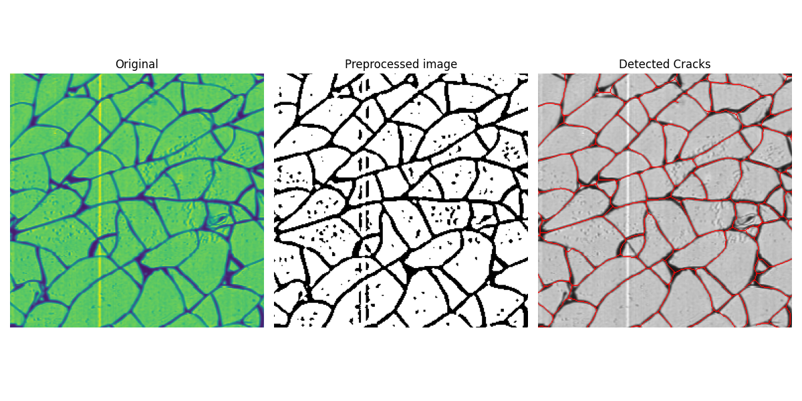

<div align="center">
   
   
</div>

<div align="center>
   <p>
   This package helps identifying splinters on broken glass plys.

   It performs several operations on the input image to enhance the visibility of scanned cracks and analyzes contours in the image. Filtering then helps to remove unwanted artifacts like dust speckles or glue residue. The remaining contours are then used to calculate the size (in px) as well as the round- and rough-ness of the splinter.
   </p>
</div>

[](https://pepy.tech/project/fracsuite)
[](https://pepy.tech/project/fracsuite)
[](https://zenodo.org/badge/latestdoi/675402888)

> For citation please use:
> ```
> @software{fracture-suite,
>   author       = {Leon Bohmann},
>   title        = {leonbohmann/fracture-suite: 0.1.7},
>   month        = sep,
>   year         = 2023,
>   publisher    = {Zenodo},
>   version      = {0.1.7},
>   doi          = {10.5281/zenodo.8369156},
>   url          = {https://doi.org/10.5281/zenodo.8369156}
> }
> ```




## How it works

Several steps are necessary to analyze a fracture scan:
1. Cropping of input image (_optional_)
   1. Analyze the image and find the biggest rectangular shape
   2. Perspective transform the image, so that the rectangle is filling the extents
2. Preprocessing
   1. Gaussian Blur + (_optional_) Resize of the input image
   2. Adaptive Threshold
3. Contour detection
   1. Find all contours on the preprocessed image
   2. Filter Contours, remove all:
      1. Whose perimeter is too small
      2. Whose area is way too large (25000px²)
4. Create stencil with the found contours
   1. This helps to quickly remove all contours that lie within a bigger contour
   2. Draw all contours onto a new image (resulting image will display the cracks)
5. Skeletonization #1
   1. Skeletonize the stencil to minimize the crack width to 1px wide lines
   2. Use Erode/Dilate (closing kernel) to connect gaps in contours (this will widen the 1px wide lines)
6. Skeletonization #2
   1. Skeletonize the image again to retrieve the crack middle lines
7. (_enabled by default_) Remove splinters, whose are is all black in the original image and fill those spaces
8. Contour detection #2
   1. Now with minimal fuzziness, run the splinter detection again
9. Create splinters from resulting contour list

A couple of outputs are saved to a directory next to the input image. These are:

- Contour plot of recognized splinters (you have to zoom in, contour thickness is 1px)
- Filled plot of splinters
- Figures
  - Splinter size distribution
  - Splinter relative share distribution
  - Voronoi overview
  - Fracture Intensity overlay

## Installation

```bat
pip install fracsuite
```

## Usage (:warning: 0.1.7 only!)
<!--
### Settings

```bat
py -m fracsuite config "key" "value"
```

Use `base_path` to specify a base folder for specimens. After that, you can use a specimen ID as a path for other modules. There are a lot of other configs, you can list them using the `list` subcommand. -->

### Use the module directly

```bat
py -m fracsuite.splinters "path/to/image"
```

For details see: [API Docs](fracsuite.md)

### Create a script

```python
from fracsuite.splinters.analyzer import Analyzer, AnalyzerConfig

image = r"Path/to/some/image.bmp"

config = AnalyzerConfig()
# size of cropped image (if cropping is needed)
config.cropsize = (4000,4000)

analyzer = Analyzer(image, config)
```
