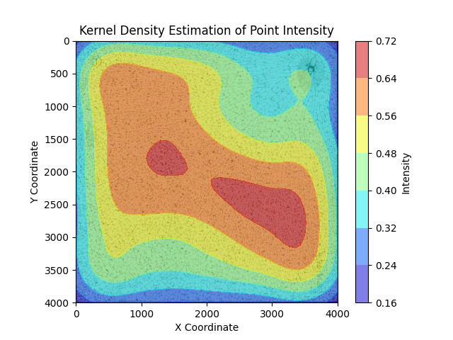

# Fracture Suite

This package helps identifying splinters on broken glass plys.

It performs several operations on the input image to enhance the visibility of scanned cracks and analyzes contours in the image. Filtering then helps to remove unwanted artifacts like dust speckles or glue residue. The remaining contours are then used to calculate the size (in px) as well as the round- and rough-ness of the splinter.




## How it works

Several steps are necessary to analyze a fracture scan:
1. Cropping of input image (_optional_)
   1. Analyze the image and find the biggest rectangular shape
   2. Perspective transform the image, so that the rectangle is filling the extents
2. Preprocessing
   1. Gaussian Blur + (_optional_) Resize of the input image
   2. Adaptive Threshold
3. Contour detection
   1. Find all contours on the preprocessed image
   2. Filter Contours, remove all:
      1. Whose perimeter is too small
      2. Whose area is way too large (25000px²)
4. Create stencil with the found contours
   1. This helps to quickly remove all contours that lie within a bigger contour
   2. Draw all contours onto a new image (resulting image will display the cracks)
5. Skeletonization #1
   1. Skeletonize the stencil to minimize the crack width to 1px wide lines
   2. Use Erode/Dilate (closing kernel) to connect gaps in contours (this will widen the 1px wide lines)
6. Skeletonization #2
   1. Skeletonize the image again to retrieve the crack middle lines
7. (_enabled by default_) Remove splinters, whose are is all black in the original image and fill those spaces
8. Contour detection #2
   1. Now with minimal fuzziness, run the splinter detection again
9. Create splinters from resulting contour list

A couple of outputs are saved to a directory next to the input image. These are:

- Contour plot of recognized splinters (you have to zoom in, contour thickness is 1px)
- Filled plot of splinters
- Figures
  - Splinter size distribution
  - Splinter relative share distribution
  - Voronoi overview
  - Fracture Intensity overlay

## Installation

```bat
pip install fracsuite
```

## Usage


### Use the module directly

```bat
py -m fracsuite.splinters "path/to/image"
```

### Create a script

```python
from fracsuite.splinters.analyzer import Analyzer, AnalyzerConfig

image = r"Path/to/some/image.bmp"

config = AnalyzerConfig()
# size of cropped image (if cropping is needed)
config.cropsize = (4000,4000)

analyzer = Analyzer(image, config)

analyzer.plot()
analyzer.plot_area()
analyzer.plot_area_2()
```

### CLI

```bat
options:
  -h, --help            show this help message and exit

General:
  --displayplots        Instruct the analyzer to display output plots.
  --debug               Sets a debug flag to display verbose output.
  --exp-debug           Sets an experimental debug flag to display verbose output.
  -display-region DISPLAY_REGION DISPLAY_REGION DISPLAY_REGION DISPLAY_REGION
                        Region to display in debug outputs.

Image operations:
  image                 The image to be processed.
  -realsize REALSIZE REALSIZE
                        Real size of the input image.
  -cropsize CROPSIZE CROPSIZE
                        Crop image size in pixels.

Preprocessor:
  -gauss-size GAUSS_SIZE
                        Gaussian filter size
  -gauss-sigma GAUSS_SIGMA
                        Gaussian filter sigma
  -min-area MIN_AREA    Minimum fragment area threshold [px²]
  -max-area MAX_AREA    Maximum fragment area threshold [px²]
  -thresh-sens THRESH_SENS
                        Adaptive threshold sensitivity
  -thresh-block {1,3,5,7,9,11,13,15,17,19,21}
                        Adaptive threshold block size
  -resize-fac RESIZE_FAC
                        Image resize factor before adaptive th.

Postprocessor:
  -skelclose-sz SKELCLOSE_SZ
                        Size for final skeleton close kernel.
  -skelclose-amnt SKELCLOSE_AMNT
                        Iterations for final skeleton close kernel.
  --skip-spot-elim      Instruct the postprocessor to skip "dark-spot" removal.
  -intensity-width INTENSITY_WIDTH
                        Pixel width for intensity calculation.

Output:
  -out [OUT]            Output directory path.
  -plot-ext [{png,pdf,jpg,bmp}]
                        Plot file extension. Default: png.
  -image-ext [{png,jpg,bmp}]
                        Image file extension. Default: png.
```